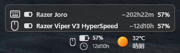
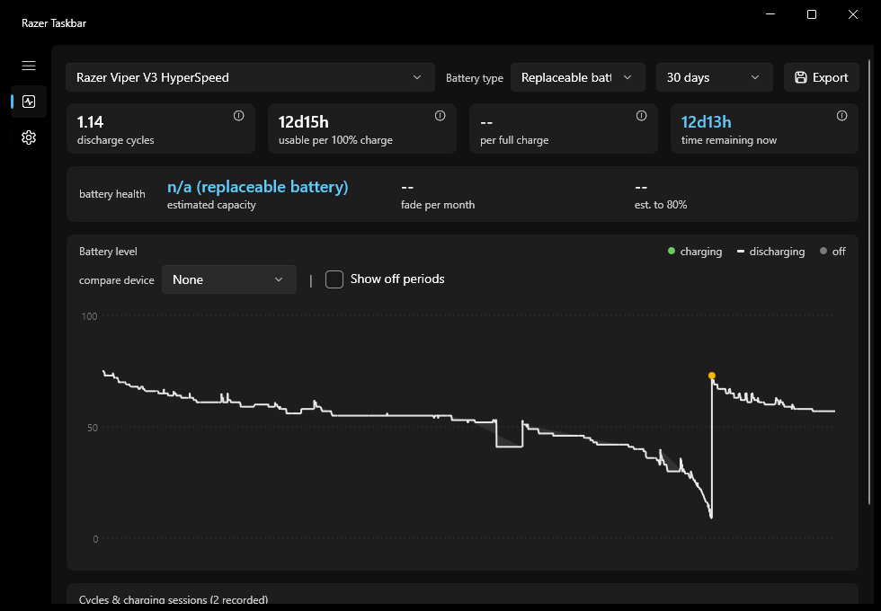

# razer-taskbar

A battery widget for the Windows taskbar. razer-taskbar shows the battery level of your
Razer mouse, keyboard or headset as a small, unobtrusive widget that lives right on the
taskbar — always visible, never in the way.

Battery data is read **directly from the hardware** over USB or Bluetooth, so Razer
Synapse is **optional**: it is only used as a fallback for devices whose battery can't be
queried directly (some headsets), and to bridge device identities over Bluetooth.

Free and open source (GPLv3), built with C# / WinUI 3.

## Features

* **Taskbar widget** — battery percentage with a color-coded battery glyph and a charging
  bolt; sits next to the tray (or on the left), and is click-through, so it never steals a
  click.
* **Time estimates** — predicts usable time left while discharging and time to full while
  charging, learned from each device's own usage history.
* **Hover device list** — rest the cursor on the widget to see every known device at a
  glance, with the one being shown highlighted.
* **Battery history** — optional recording to a local database, with a history window
  (level chart, cycle stats, battery health) that explains where the estimates come from.
* **Settings window** — every option applies live, no restart needed; the UI ships in
  English and 中文.
* **No images, no installer** — the widget is drawn natively and stays crisp at any DPI.

## Screenshots





## Requirements

* Windows 10 or 11
* .NET 8 SDK (only needed to build)
* Windows App SDK Runtime (optional) — needed for the Settings and Battery history
  windows; without it the app runs in widget-only mode
* Razer Synapse 3 or 4 (optional) — the fallback battery source, see
  [How it works](#how-it-works)

## Getting started

Build (or run `build.ps1`, which also stops a running instance and deploys for you):

```powershell
dotnet publish src/RazerTaskbar/RazerTaskbar.csproj -c Release -p:Platform=x64 -o dist
```

Then start `dist\razer-taskbar.exe`. There is no installer — the folder can be copied
anywhere. Turn on *Run at startup* in the Settings window to start it with Windows.

For development, the unit tests live in `tests/RazerTaskbar.Tests`:

```powershell
dotnet test tests/RazerTaskbar.Tests/RazerTaskbar.Tests.csproj
```

## Using the widget

The widget itself is click-through, so the right-click menu lives on the tray icon (if
enabled). It is deliberately small:

* The device list — *Lowest battery device*, or any single connected device.
* *Settings…* / *Battery history…* — open the control panel.
* *Exit*.

Double-clicking the tray icon opens the Battery history window directly.

Everything else lives in the **Settings** window, grouped into *Widget*, *History* and
*General*:

* Display mode — fixed, temporarily swap on a battery drop, or rotate all devices.
* Widget side, plus the embedding options (into the taskbar itself, or into the widgets
  button's free space).
* Time remaining, colored battery icon, fade transition, hover device list.
* History recording interval.
* Language (Auto / English / 中文) and run at startup.

Every change applies and persists immediately — nothing needs a restart. Settings are
stored in `%APPDATA%\razer-taskbar\settings.json`, and battery history is recorded to a
`battery.db` database next to it. Both stay on your machine.

### Battery history & predictions

With *Record battery history* enabled, every connected device is sampled into the local
database — whenever its level, charging state or connection changes, plus a periodic
heartbeat. From that history the widget learns each device's habits and predicts:

* **Usable time left** while discharging, and **time to full** while charging. Predictions
  account for real-world quirks: battery swaps (a fresh cycle starts at the new level),
  idle periods that cost no time, and the slowing charge tail near 100%.
* **Battery health** in the history window — how today's charge speed compares with the
  device's earliest recorded sessions, and where the wear trend is heading.

The *Battery history…* window shows the level-over-time chart (green while charging, dark
bands for off/unknown stretches that are excluded from the stats), cycle stats and the
cycle/session list.

## Supported hardware

* Potentially any wireless Razer device compatible with Razer Synapse 3 or 4.
* Tested with: Razer Joro keyboard (dongle, cable and Bluetooth) and Razer Viper V3
  HyperSpeed mouse (2.4G dongle).
* **Untested**: gamepads and wireless headsets — the author has neither on hand, so these
  device types could not be verified. If you own one and it misbehaves, please open an
  issue with the device model and the log file.

What each connection mode provides — plain-language version; the full protocol notes live
in [docs/agent-hid.md](docs/agent-hid.md):

|                       | 2.4G dongle | USB cable | Bluetooth                                |
| --------------------- | ----------- | --------- | ---------------------------------------- |
| Battery level         | ✅          | ✅        | ✅                                       |
| Charging status       | via Synapse | ✅        | ✅ (if the channel is free)              |
| Device identity       | ✅          | ✅        | ✅ (or via Synapse, else a MAC-based id) |
| Works without Synapse | ✅          | ✅        | ✅                                       |

All three modes share one device identity, so the widget and its history follow the
physical device, not how it happens to be connected. Devices the direct queries can't
reach (headsets) fall back to Synapse logs, and hardware in a power-saving state can't be
queried at all.

## How it works

A few notes for the curious — full design notes live in [docs/](docs):

* **Battery source** (`battery_source=auto`): direct USB HID queries on the dongle/cable,
  Razer's private vendor channel on Bluetooth, and Synapse log parsing as the fallback.
* **The widget is an overlay**: a small always-on-top, click-through window above the
  taskbar — not a child of it — so it stays visible even with TranslucentTB-style taskbar
  mods and never intercepts a click. It re-anchors itself whenever the taskbar changes
  (tray icons appearing or disappearing, an explorer restart) and keeps clear of the Win11
  widgets (weather) button. See [docs/agent-taskbar.md](docs/agent-taskbar.md).
* **Predictions** are learned per device from its recorded history (recency-weighted
  cycles plus per-level charge/discharge profiles), with reporting glitches, battery
  swaps and idle stretches filtered out along the way. See
  [docs/agent-history.md](docs/agent-history.md).
* **Everything is drawn natively** — the battery, the device type icons, all of it — no
  bitmap assets, DPI-aware.

## Inspired by & acknowledgments

* [sanraith/razer-taskbar](https://github.com/sanraith/razer-taskbar) — the direct
  upstream: this project started as a port of its Synapse log watcher and device
  selection (TypeScript / Electron).
* [OpenRazer](https://github.com/openrazer/openrazer) — the USB HID vendor protocol is
  ported from its kernel driver.
* [Tekk-Know/RazerBatteryTaskbar](https://github.com/Tekk-Know/RazerBatteryTaskbar) —
  the original widget idea.
* [TrafficMonitor](https://github.com/zhongyang219/TrafficMonitor) — the approach to
  embedding into the taskbar.
* [Taskbar-Lyrics](https://github.com/mo-jinran/Taskbar-Lyrics) — the event-driven
  taskbar layout.

## License

Licensed under the GNU GPLv3 or any later version — see
[LICENSE](LICENSE) (SPDX: `GPL-3.0-or-later`). Third-party code keeps its
own terms; attributions and license texts are collected in
[THIRD-PARTY-NOTICES.md](THIRD-PARTY-NOTICES.md):

* [sanraith/razer-taskbar](https://github.com/sanraith/razer-taskbar) — MIT
  (Synapse log watcher, device-selection logic).
* [OpenRazer](https://github.com/openrazer/openrazer) — GPL-2.0-or-later
  (USB HID protocol layer in `src/RazerTaskbar.Core/Hid/`).

## Disclaimer

This is an **unofficial** community tool. It is not affiliated with, endorsed
by or sponsored by Razer Inc. "Razer" and the triple-headed snake logo are
trademarks of Razer Inc., referenced here only to describe which hardware the
tool works with.

The app icon (`assets/app.ico`) incorporates the Razer snake logo, which
remains the property of Razer Inc.; it is used without permission, for
personal, non-commercial use only, and the icon's inclusion in this repository
does not constitute a challenge to any Razer trademark or copyright.

If you redistribute the project, or simply prefer to avoid the trademark, the
icon is easy to remove:

1. Delete or replace `assets/app.ico`.
2. Remove the `<ApplicationIcon>` reference in `src/RazerTaskbar/RazerTaskbar.csproj`.
3. Remove the `AppWindow.SetIcon` call in
   `src/RazerTaskbar/Features/ControlPanel/ControlPanelWindow.xaml.cs`.

The app builds and runs fine without it.
